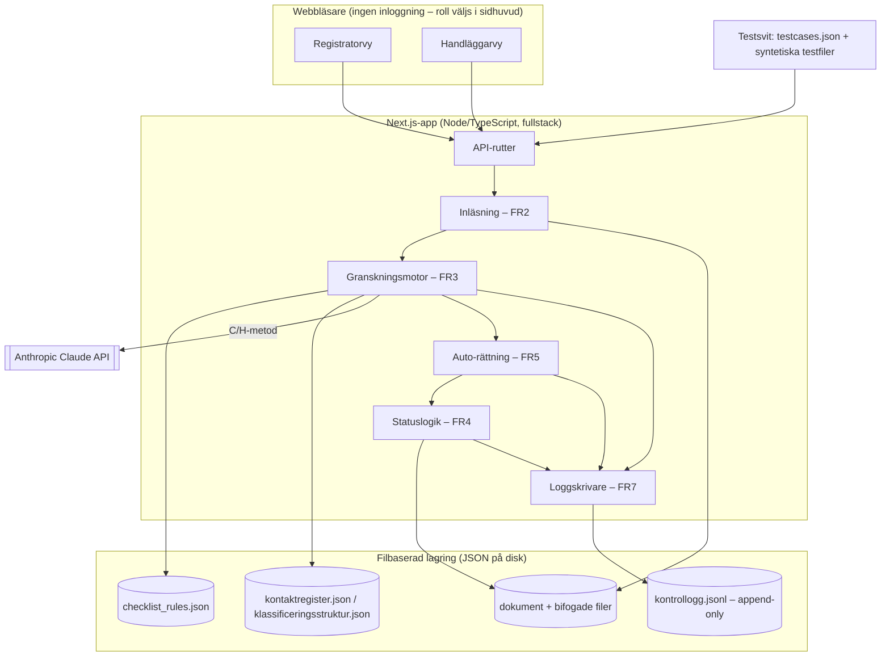

# Architectural Decision Record: AI-kvalitetskontrollant i diariet

> Detta dokument beskriver hur prototypen hänger ihop och de viktigaste arkitekturbesluten bakom den. Besluten nedan gäller tills vidare och ska följas i varje AI-session som arbetar med kodbasen — ändra dem här, inte genom att avvika i koden.

## Skiss

Prototypen är en enda Next.js-app: samma tjänst serverar både UI (registrator- och handläggarvy, rollväljare i sidhuvudet) och API-rutterna som kör inläsning, granskning, auto-rättning, statuslogik och loggning. All data — regelkatalog, referensdata, inlästa dokument och kontrolloggen — ligger som JSON-filer på disk i stället för i en databas. Extern beroende finns bara till Anthropic Claude API för de AI-bedömda reglerna (metod C/H); om det anropet failar degraderar granskningsmotorn i stället för att krascha (se Beslut 2).

## Beslut 1: Regler som datadriven konfiguration

**Läge.** Checklistans 29 regler måste kunna förvaltas av verksamheten — ändra regeltext, allvarlighetsgrad eller auto-rättningsflagga — utan att någon rör kod (NFR Maintainability, FR1). Regel-ID:n måste dessutom vara kompatibla med `testcases.json`, och varje granskning ska kunna spåras till en specifik version av regelkatalogen.

**Val.** Regelkatalogen lagras som en fristående, versionerad JSON-fil (`checklist_rules.json`) helt separat från granskningskoden. Granskningsmotorn laddar och tolkar filen vid varje körning i stället för att ha reglerna hårdkodade, validerar den (unika ID:n, giltiga värden för nivå/metod/allvarlighetsgrad, auto-rättning bara tillåten för metod M) innan någon granskning får starta, och skriver katalogens versionsnummer till varje loggpost.

**Konsekvenser.** Verksamheten kan ändra regeltext, allvarlighetsgrad och auto-flagga utan driftsättning av ny kod, testsviten kan köras mot samma katalog som produktionslogiken, och det går alltid att se i loggen vilken regelversion ett historiskt fynd byggde på. Priset är att en ogiltig katalog stoppar all granskning tills den rättas, att motorn måste hålla valideringslogik separat från själva datan, och att metod-fälten (M, M+L, C, H) bara är en pekare till kod i motorn — själva bedömningslogiken för C- och H-regler ligger fortfarande hårdkodad i applikationen, inte i JSON-filen. Katalogen är alltså datadriven för konfiguration, inte för algoritmen.

## Beslut 2: Granskningspipeline — deterministiskt → AI → status

**Läge.** FR3 och FR4 kräver att alla regler körs i en bestämd ordning: deterministiska kontroller (metadata, uppslag mot kontaktregister/klassificeringsstruktur, filanalys) ska alltid köras, och AI-bedömningar av innehåll, språk och rimlighet ska bygga vidare på det. Om AI-tjänsten inte svarar, svarar för sent eller ger ett svar som inte går att tolka, ska de deterministiska reglerna ändå ha körts och dokumentet ska gå till Mänsklig bedömning i stället för att granskningen stannar helt — lösningen får aldrig bli en svart låda som tystnar vid fel.

**Val.** Granskningen byggs som en sekventiell pipeline i granskningsmotorn: (1) alla deterministiska regler körs och ger utfall direkt, (2) AI-bedömningarna anropas mot Anthropic Claude API med timeout och felhantering, där ett fel, en timeout eller ett svar under konfidenströskeln sätter utfallet "ej genomförd"/osäkert i stället för att avbryta granskningen, (3) statuslogiken (FR4) tillämpas på samtliga utfall, varpå ev. auto-rättning (FR5) körs och alla regler körs om exakt en gång mot det uppdaterade dokumentet.

**Konsekvenser.** Beteendet vid AI-fel blir förutsägbart och testbart — motorn degraderar till Mänsklig bedömning snarare än att krascha eller ge falskt godkänt — och den deterministiska delen kan enhetstestas som en ren funktion oberoende av nätverk och LLM. Nackdelen är att en granskning kan kräva flera LLM-anrop (ordinarie körning plus en omkörning efter auto-rättning), vilket sätter press på 30 s p95-kravet, och att pipeline-ordningen (determinism före AI, en enda omkörning) ligger hårdkodad i motorn snarare än som data — att ändra processflödet, t.ex. fler omkörningar eller parallella AI-anrop, kräver en kodändring, inte en konfigurationsändring.

## Beslut 3: Oföränderlig kontrollogg (append-only)

**Läge.** FR7 och NFR Traceability kräver att 100 % av statusbyten, ändringar och mänskliga beslut loggas, att loggposter inte går att ändra eller radera via gränssnittet, och att en dataändring — inklusive auto-rättningar — inte får genomföras om dess loggpost inte kan skrivas. Loggen ska också visa hela historiken när ett dokument granskats flera gånger.

**Val.** Kontrolloggen implementeras som en append-only JSONL-fil (`kontrollogg.jsonl`): varje händelse (regelutfall, fynd, ändring före/efter, statusbyte, mänskligt beslut) skrivs som en ny rad och existerande rader skrivs aldrig om. Loggskrivningen sker synkront och måste lyckas innan motorn tillåter motsvarande status- eller dataändring i dokumentet — misslyckas skrivningen avbryts hela operationen (inklusive auto-rättningen) och ett felmeddelande visas. Inget API eller UI exponerar uppdatering eller radering mot loggfilen.

**Konsekvenser.** Historiken blir enkel att granska, diffa och visa rad för rad i loggvyn, och kravet "ingen ändring utan logg" uppfylls strukturellt eftersom det tekniskt bara går att lägga till rader, inte skriva över dem — det krävs ingen separat behörighetskontroll för att förhindra ändring. Priset är att loggen inte har något index: att hämta historiken för ett specifikt dokument eller den senaste statusen kräver att hela filen läses och filtreras, vilket inte skalar bortom prototypens datamängder. Samtidiga skrivningar till samma fil kräver ett enkelt lås, och eftersom filen bara växer måste rensning/arkivering hanteras som en öppen fråga i integrationsplanen (FR11) inför en eventuell produktionssättning.
